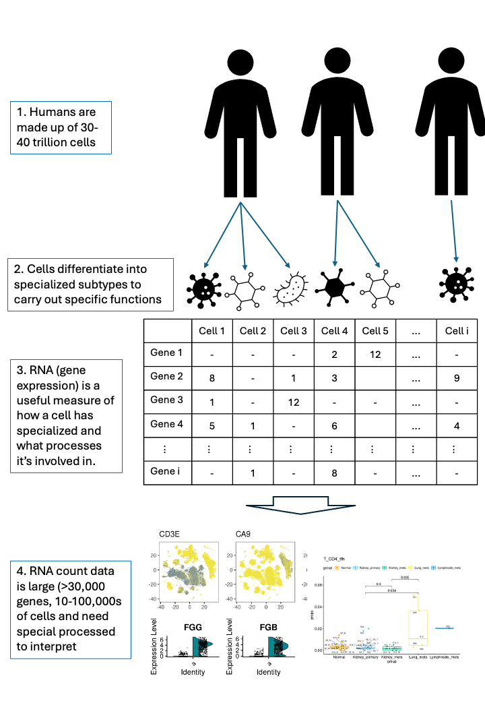

```{r, include = FALSE}
knitr::opts_chunk$set(
  collapse = TRUE,
  comment = "#>"
)
```

Single-cell data


````{r echo = TRUE, fig.cap = "RNA extracted from single cells can be measured and analysed.", out.width = '100%'}



````


